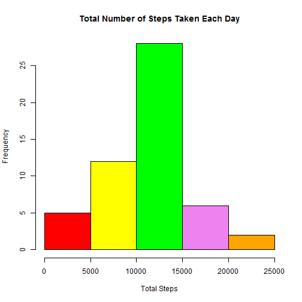
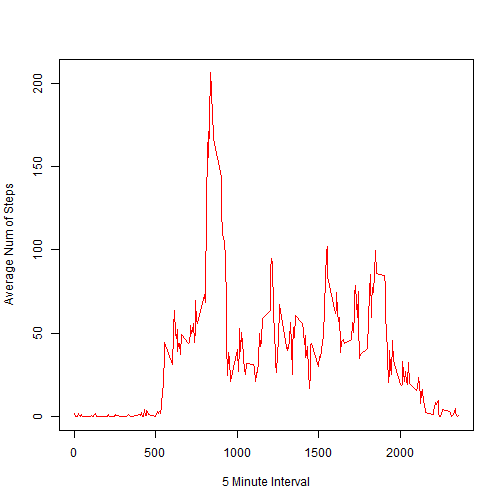
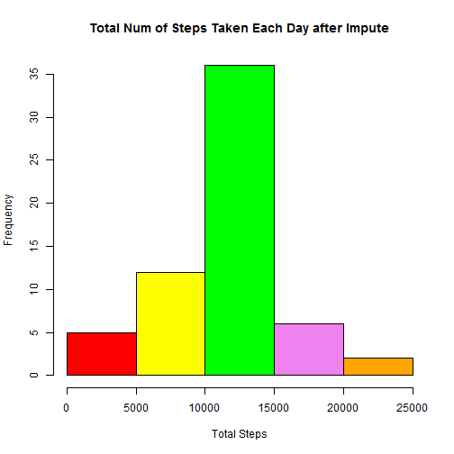
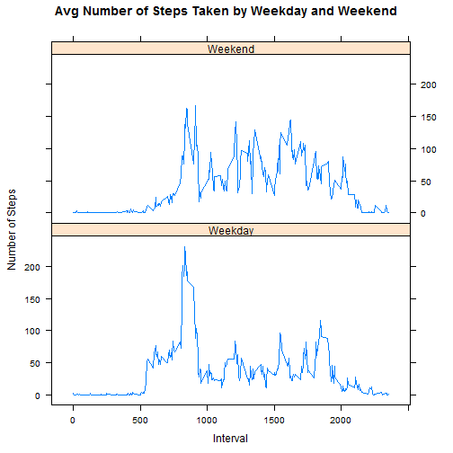

## Import Data

Read the Activity Dataset


```r
setwd("C:/Users/SIVARS3/Desktop/Couresra Certificate/Course 5")
activity <- read.csv("activity.csv", stringsAsFactors = F)
 activity$date <- as.Date(activity$date)
 str(activity)
```

```
## 'data.frame':	17568 obs. of  3 variables:
##  $ steps   : int  NA NA NA NA NA NA NA NA NA NA ...
##  $ date    : Date, format: "2012-10-01" "2012-10-01" ...
##  $ interval: int  0 5 10 15 20 25 30 35 40 45 ...
```

```r
 Activity2 = activity[complete.cases(activity==T),]
```

## Calculate Total Steps and Histogram

Calculate the total steps for each day


```r
Totalsteps = sum(Activity2$steps)
 Totaldays = length(unique(Activity2$date))
 library(plyr)
Histprep <- ddply(Activity2, .(date), summarize, TotalSteps = sum(steps))
colors = c("red", "yellow", "green", "violet", "orange", "blue", "pink", "cyan") 
Hist1 = hist(Histprep$TotalSteps,  col=colors,  main="Total Number of Steps Taken Each Day",  xlab="Total Steps") 
```



```r
mean(Histprep$TotalSteps)
```

```
## [1] 10766.19
```

```r
median(Histprep$TotalSteps)
```

```
## [1] 10765
```

```r
Hist1$counts
```

```
## [1]  5 12 28  6  2
```


## Create Plot

Create line chart showing average number of steps


```r
Plotprep <- ddply(Activity2, .(interval), summarize, AvgSteps = mean(steps))
plot(Plotprep$interval, Plotprep$AvgSteps, type="l", col="red", xlab="5 Minute Interval", ylab="Average Num of Steps")
```



```r
Plotprep[(Plotprep$AvgSteps==max(Plotprep$AvgSteps)),]
```

```
##     interval AvgSteps
## 104      835 206.1698
```


## Impute Data

Fill up the missing rows with mean for that 5-minute interval


```r
MissingActivity = activity[!complete.cases(activity==T),]
nrow(MissingActivity)
```

```
## [1] 2304
```

```r
Imputed = merge(MissingActivity, Plotprep, by ="interval", all.x = T)
Imputed$steps = Imputed$AvgSteps
Imputed = Imputed[, -4]
CorrectedActivity = rbind(Activity2, Imputed)
```


## Create Histogram

Create Histogram from the Imputed Data


```r
Histprep2 <- ddply(CorrectedActivity, .(date), summarize, TotalSteps = sum(steps))
colors = c("red", "yellow", "green", "violet", "orange", "blue", "pink", "cyan") 
Hist2 = hist(Histprep2$TotalSteps,  col=colors,  main="Total Num of Steps Taken Each Day after Impute",  xlab="Total Steps") 
```



```r
mean(Histprep2$TotalSteps)
```

```
## [1] 10766.19
```

```r
median(Histprep2$TotalSteps)
```

```
## [1] 10766.19
```

```r
Hist2$counts
```

```
## [1]  5 12 36  6  2
```

While the mean value of the Total Steps remained the same before and after impute, there was a slight change in median value as it increased from 10765 to 10766.19. This is due to many of the imputed values fell into the 10,000 to 15,000 Total Steps bin range as seen by the increase in frequency of that bin from 28 to 36.

## Flag Weekday and Weekend

Create a flag to distinguish weekday and weekend


```r
CorrectedActivity$DayFlag = weekdays(CorrectedActivity$date)
library(chron)
CorrectedActivity$weekend = chron::is.weekend(CorrectedActivity$date)
Plotprep2 <- ddply(CorrectedActivity, .(interval, weekend), summarize, AvgSteps = mean(steps))
for ( i in 1:576)
{
  if(Plotprep2$weekend[i]==TRUE)
    {Plotprep2$WeekendFlag[i] = "Weekend"}
  else {Plotprep2$WeekendFlag[i] = "Weekday"}
}
```


## Create Plot by Weekday and Weekend

Create another plot showing average number of steps taken by weekday and weekend

```r
library(lattice)
attach(Plotprep2)
```

```
## The following objects are masked from Plotprep2 (pos = 3):
## 
##     AvgSteps, interval, weekend, WeekendFlag
```

```r
xyplot(AvgSteps ~ interval|WeekendFlag, data = Plotprep2,
        type = "l", main="Avg Number of Steps Taken by Weekday and Weekend",
       xlab="Interval", ylab="Number of Steps", layout=c(1,2))
```


